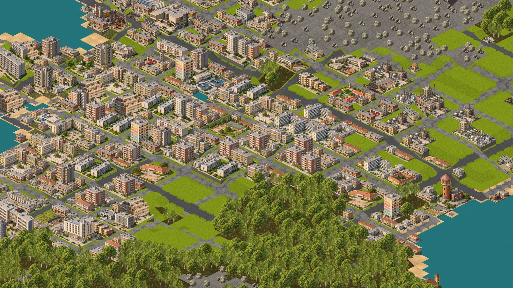
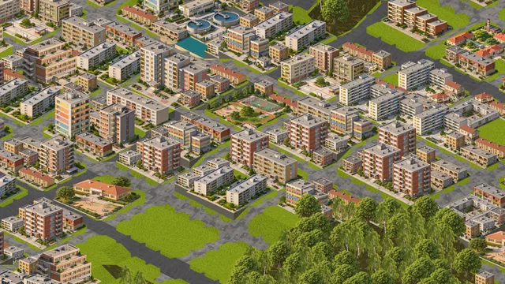
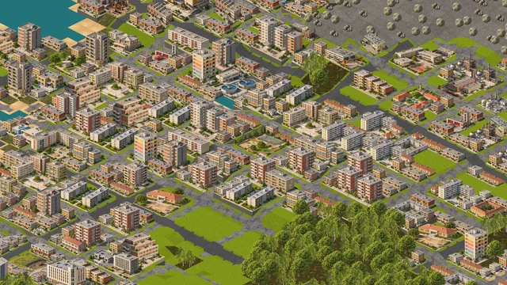

# Zdenalcity

Izometrický budovatel měst ve stylu SimCity 2000. Běží v prohlížeči, na počítači
i na telefonu, česky i anglicky.

**▶ Hrát: [games.zdendas.cz/zdenalcity](https://games.zdendas.cz/zdenalcity/)**



| | |
|---|---|
|  |  |

*An isometric city builder in the spirit of SimCity 2000, written in TypeScript
and PixiJS. Runs in the browser, in Czech and English.
[Play it here.](https://games.zdendas.cz/zdenalcity/)*

## Co ve hře je

- **Zóny a růst:** bydlení, obchod a průmysl, pět úrovní budov, rozšiřování
  a slučování parcel, chátrání a opuštěné domy. Růst řídí poptávka, daně,
  cena půdy a dostupnost práce.
- **Terén:** generátor map se šesti typy krajiny, svahy, řeky, skála a mokřady,
  terraforming, mosty a volitelná velikost mapy.
- **Doprava:** několik typů silnic, dopravní model s kolonami, MHD s linkami,
  zastávkami, vozovnami a jízdným.
- **Sítě:** elektřina s vysokým a nízkým napětím, trafostanicemi a rozvodnami,
  vodovod a kanalizace v podzemním pohledu.
- **Služby:** policie, hasiči, zdravotnictví, školství, kultura a sociální
  služby s dosahem a financováním. Kriminalita, znečištění a spokojenost
  obyvatel.
- **Peníze:** rozpočet, daně, údržba, půjčky, dotace, dluhopisy a úvěrový
  rating. Měnou jsou Kčs.
- **Katastrofy:** požáry, povodně, tornáda, zemětřesení, sesuvy, výbuchy,
  průmyslové a chemické havárie, blackout, epidemie, stávky a nepokoje.
  Dají se vypnout.
- **Ostatní:** ukládání a načítání her, nápověda, poradce, roční vyúčtování,
  přepínač CZ / EN a instalace jako aplikace (PWA).

## Spuštění

Je potřeba Node `^20.19.0 || >=22.12.0`.

```bash
npm install
npm run dev
```

Vite vypíše adresu, na které hra běží (standardně `http://localhost:5173`).

| Příkaz | Co dělá |
|---|---|
| `npm run dev` | vývojový server |
| `npm run build` | typová kontrola a produkční build do `dist/` |
| `npm run preview` | servíruje hotový build |
| `npm test` | testy (Vitest) |
| `npm run check` | lint, typecheck a testy; musí projít před každým commitem |

Hra je čistě statická, k provozu nepotřebuje žádný server. Postup nasazení
je v [docs/DEPLOY.md](docs/DEPLOY.md).

## Jak je projekt postavený

Stack: **TypeScript, PixiJS 8, Vite**. Rozhraní je v obyčejném HTML a CSS.

```
src/
  sim/       simulace: deterministická, bez DOM a bez rendereru
  render/    izometrické vykreslování (PixiJS), kamera, picking
  ui/        HUD, nástroje, panely, nápověda, překlady
  content/   načítání obsahu přes ContentSource
  save/      ukládání, ZIP kontejner, migrace mezi verzemi
  platform/  prohlížeč: úložiště, preference
content/vanilla/
  buildings/ definice budov v JSON
  sprites/, tiles/, icons/, parts/, skirts/   obrázky
  locale/    cs.json, en.json
  balance.json
tests/       jednotkové a golden testy, fixtury savů
tools/       skripty pro sprity, ikony, dlaždice a simulace
docs/        specifikace a záznam postupu
```

Pravidla, která drží architekturu pohromadě:

1. **Simulace nezná renderer.** `src/sim/` nesmí importovat Pixi, DOM ani
   `render/`, `ui/` a `platform/`. Hlídá to ESLint.
2. **Simulace je deterministická.** Stejný seed a stejné vstupy dají
   bit-identický výsledek. Žádné `Math.random` ani `Date.now`, jen `world.rng`.
3. **Simulace pracuje v gridových souřadnicích.** Izometrie existuje jen
   v `src/render/`.
4. **Mřížková data jsou typed arrays**, jedna vrstva na atribut, ne pole objektů.
5. **Obsah jsou data.** Žádná konkrétní budova není v kódu, všechno je JSON
   v `content/`, takže ho mod může přidat i přepsat.
6. **ID definic jsou stringy s namespace** (`vanilla:clinic`), v savu nikdy čísla.
7. **Save má `formatVersion`** a migrace jsou čisté funkce ověřené fixturami.

Podrobnosti jsou ve [specifikaci architektury](docs/01-ARCHITEKTURA.md),
aktuální stav v [docs/PROGRESS.md](docs/PROGRESS.md).

## Grafika

Sprity budov, povrchy terénu, ikony a obrázky událostí vznikly generováním
obrázků a následným zpracováním skripty v `tools/` (ořez, sladění s izometrickou
mřížkou, převod do WebP). Skripty, které volají OpenAI Images API, čtou klíč
z proměnné prostředí `OPENAI_API_KEY`. Pro hraní ani vývoj kódu potřeba není,
hotové obrázky jsou v repozitáři. Když nějaký obrázek chybí, hra místo něj
nakreslí jednoduchý kvádr.

Zadání a postupy: [sprity služeb](docs/06-SPRITY-SLUZEB.md),
[sprity zón](docs/07-SPRITY-ZONY.md), [dlaždice](docs/08-DLAZDICE.md),
[ikony](docs/09-IKONY.md).

## Autor

Zdeněk Klusák ([Zdendascz](https://github.com/Zdendascz))
